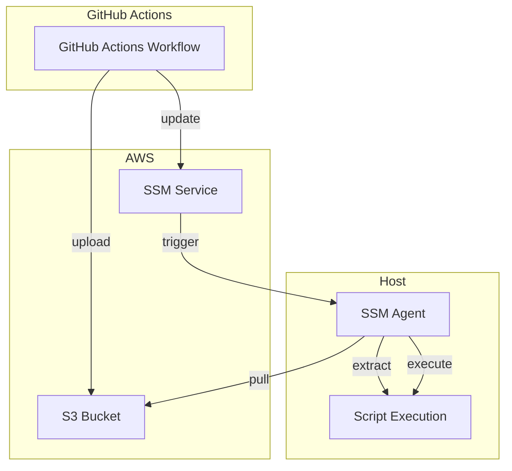
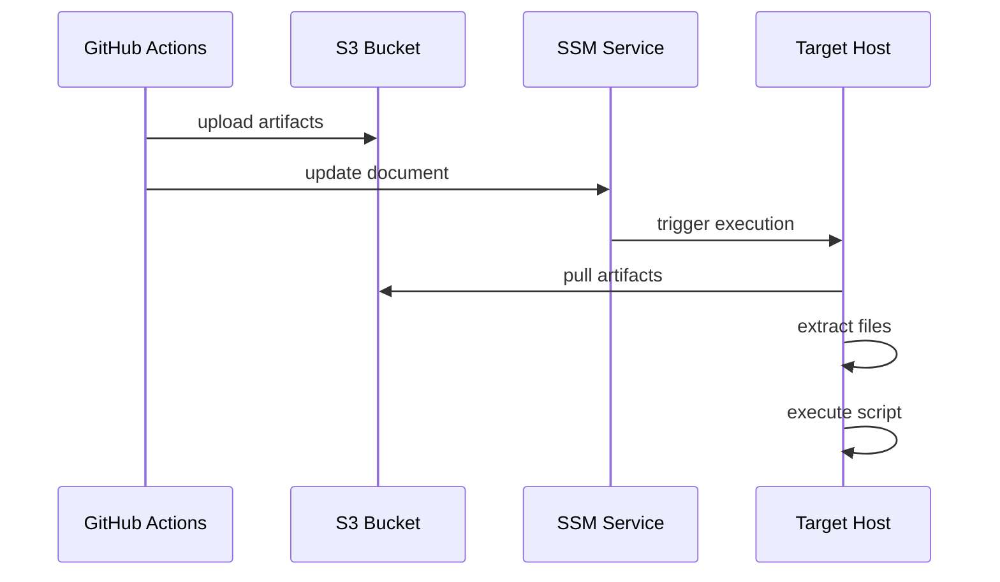

# Actions AWS Host Exec

This GitHub Action executes scripts on External Hosts or EC2 instances using AWS Systems Manager (SSM). It uploads artifacts to S3, creates an SSM document to download and extract those artifacts, and executes a script from within them on target instances.

## Architecture



## Deployment Flow



## Features

- Execute scripts on EC2 instances with artifact support
- Upload artifacts (scripts, configs, data files) to S3
- Automatically download and extract artifacts on target hosts
- Target instances using AWS tags
- Secure artifact storage in S3
- Secure execution using AWS SSM
- Support for multiple files in artifacts

## Comparison with actions-aws-host-service

| Feature | actions-aws-host-exec | actions-aws-host-service |
|---------|------------------------|--------------------------|
| **Purpose** | Run scripts with artifacts on EC2 instances | Deploy systemd services on EC2 instances |
| **Artifact Storage** | Uses S3 bucket for artifacts | Uses S3 bucket for artifacts |
| **Script Storage** | Uploaded to S3 as part of artifacts | Uploaded to S3 as part of artifacts |
| **Security** | Artifacts stored in S3 with proper permissions | Artifacts stored in S3 with proper permissions |
| **Use Case** | Script execution with supporting files | Long-running service deployment |
| **Infrastructure** | S3 bucket, SSM document, and association | S3 bucket, SSM document, and association |
| **Execution** | Script execution from artifacts | Service installation and management |

## When to use each action:

- **actions-aws-host-exec**: Use when you need to run a script with supporting files (configs, data files, etc.) on target instances. Ideal for tasks like deployments, configuration updates, data processing, or operations that require additional files.

- **actions-aws-host-service**: Use when you need to deploy a long-running systemd service with associated files and configurations. Better for applications, daemons, or other persistent processes that should run as services.

## Prerequisites

- AWS credentials with appropriate permissions
- EC2 instances with SSM agent installed
- Instances must be tagged appropriately for targeting

## Inputs

### Required Inputs

| Name | Description | Example |
|------|-------------|---------|
| `name` | Execution name | `db-backup` |
| `artifacts` | Path to folder containing artifacts to upload | `resource/my-script` |
| `script` | Path to script file within artifacts (relative to artifact root) | `backup.sh` |
| `targets` | Target selection criteria in format KEY:VALUE (one per line) | `Environment:DEV` |

### Optional Inputs

| Name | Description | Default | Example |
|------|-------------|---------|---------|
| `working-directory` | Directory to extract artifacts and execute script in | `/home/ssm-user` | `/opt/scripts` |
| `timeout` | Execution timeout in seconds | `3600` | `1800` |
| `action` | Desired outcome: apply, plan or destroy | `apply` | `plan` |

## Outputs

| Name | Description |
|------|-------------|
| `document` | SSM document ARN |
| `role_name` | IAM role name |
| `bucket` | S3 bucket name for artifacts |

## Usage

```yaml
name: Run Database Backup

on:
  schedule:
    - cron: '0 0 * * *'

permissions:
  id-token: write
  contents: read

jobs:
  backup:
    runs-on: ubuntu-latest
    
    steps:
    - uses: actions/checkout@v4

    - name: Configure AWS Credentials
      uses: aws-actions/configure-aws-credentials@v4
      with:
        role-to-assume: ${{ secrets.AWS_ROLE_ARN }}
        aws-region: us-east-1

    - uses: alonch/actions-aws-backend-setup@main
      with: 
        instance: host-exec

    - name: Execute Backup Script
      uses: realsensesolutions/actions-aws-host-exec@main
      with:
        name: daily-db-backup
        artifacts: resource/backup-script
        script: backup.sh
        working-directory: /opt/backups
        timeout: 1800
        targets: |
          Environment:PROD
          Role:DB
```

### Artifacts Folder Structure

Your artifacts folder should contain the script and any supporting files:

```
resource/backup-script/
├── backup.sh           # Main script to execute
├── config.json         # Configuration file
└── lib/               # Additional supporting files
    └── utils.sh
```

## How It Works

1. GitHub Actions packages the artifacts folder into a tarball
2. GitHub Actions uploads artifacts to S3
3. GitHub Actions creates/updates an SSM document and association
4. SSM triggers execution on target hosts
5. SSM agent on host downloads artifacts from S3
6. SSM agent extracts artifacts to working directory
7. SSM agent executes the specified script
8. The execution results are reported back to SSM

## Security

- Uses AWS IAM roles for secure access
- Artifacts are stored in a dedicated S3 bucket with proper permissions
- SSM provides secure command execution
- All resources are tagged with `provisioned-by: actions-aws-host-exec`

## Development

### Local Testing

1. Set up AWS credentials
2. Run Terraform locally:
   ```bash
   terraform init
   terraform plan
   terraform apply
   ```

### Requirements

- Terraform 1.0+
- AWS CLI configured
- Appropriate AWS permissions

## License

MIT