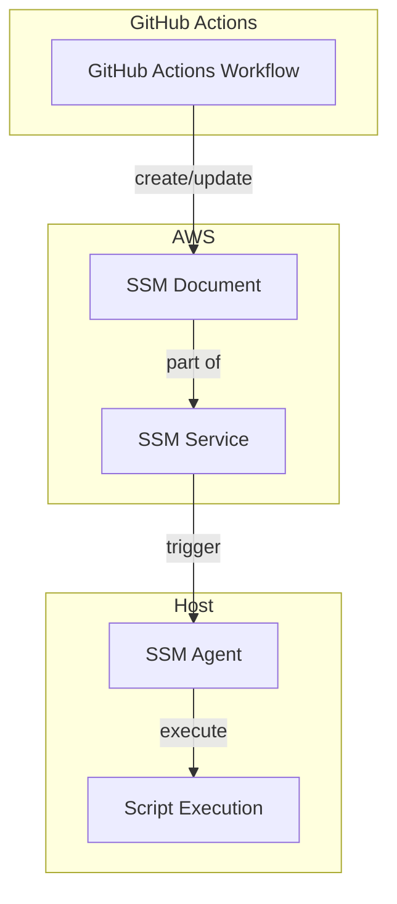
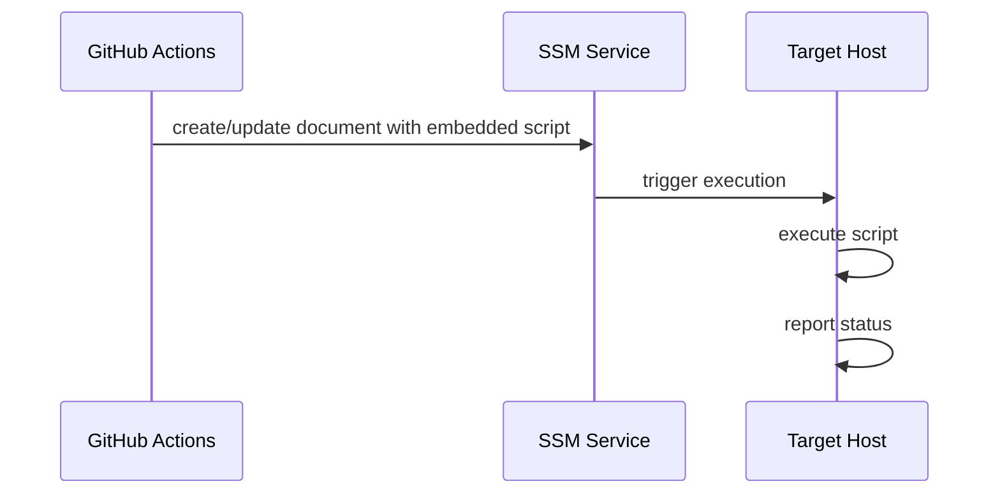

# Actions AWS Host Exec

This GitHub Action executes scripts on External Hosts or EC2 instances using AWS Systems Manager (SSM). It creates an SSM document that includes the script content directly and establishes an association to execute it on target instances.

## Architecture



## Deployment Flow



## Features

- Execute scripts on EC2 instances without uploading to S3
- Target instances using AWS tags
- Scripts are embedded directly in the SSM document
- Secure execution using AWS SSM
- Support for script parameters

## Comparison with actions-aws-host-service

| Feature | actions-aws-host-exec | actions-aws-host-service |
|---------|------------------------|--------------------------|
| **Purpose** | Run scripts on EC2 instances | Deploy systemd services on EC2 instances |
| **Artifact Storage** | No external storage needed | Uses S3 bucket for artifacts |
| **Script Storage** | Embedded in SSM document | Uploaded to S3 bucket |
| **Security** | No artifacts exposed outside SSM | Artifacts stored in S3 with proper permissions |
| **Use Case** | One-time script execution | Long-running service deployment |
| **Infrastructure** | SSM document and association | S3 bucket, SSM document, and association |
| **Execution** | Direct script execution | Service installation and management |

## When to use each action:

- **actions-aws-host-exec**: Use when you need to run a script or command on target instances without setting up a persistent service. Ideal for tasks like configuration updates, health checks, or one-time operations.

- **actions-aws-host-service**: Use when you need to deploy a long-running systemd service with associated files and configurations. Better for applications, daemons, or other persistent processes.

## Prerequisites

- AWS credentials with appropriate permissions
- EC2 instances with SSM agent installed
- Instances must be tagged appropriately for targeting

## Inputs

### Required Inputs

| Name | Description | Example |
|------|-------------|---------|
| `name` | Execution name | `db-backup` |
| `script` | Path to script file to execute | `scripts/backup.sh` |
| `targets` | Target selection criteria in format KEY:VALUE (one per line) | `Environment:DEV` |

### Optional Inputs

| Name | Description | Default | Example |
|------|-------------|---------|---------|
| `working-directory` | Directory to execute script in | `/home/ssm-user` | `/opt/scripts` |
| `timeout` | Execution timeout in seconds | `3600` | `1800` |
| `script-parameters` | Parameters to pass to the script | `""` | `"--verbose --force"` |
| `action` | Desired outcome: apply, plan or destroy | `apply` | `plan` |

## Outputs

| Name | Description |
|------|-------------|
| `document` | SSM document ARN |
| `role_name` | IAM role name |

## Usage

```yaml
name: Run Database Backup

on:
  schedule:
    - cron: '0 0 * * *'

permissions:
  id-token: write
  contents: read

jobs:
  backup:
    runs-on: ubuntu-latest
    
    steps:
    - uses: actions/checkout@v4

    - name: Configure AWS Credentials
      uses: aws-actions/configure-aws-credentials@v4
      with:
        role-to-assume: ${{ secrets.AWS_ROLE_ARN }}
        aws-region: us-east-1

    - name: Execute Backup Script
      uses: realsensesolutions/actions-aws-host-exec@main
      with:
        name: daily-db-backup
        script: scripts/backup.sh
        working-directory: /opt/backups
        timeout: 1800
        script-parameters: "--type=full"
        targets: |
          Environment:PROD
          Role:DB
```

## How It Works

1. GitHub Actions reads the script file
2. GitHub Actions creates/updates an SSM document with the script content embedded
3. GitHub Actions creates an SSM association to target instances
4. SSM triggers execution on target hosts
5. SSM agent on host executes the script
6. The script execution results are reported back to SSM

## Security

- Uses AWS IAM roles for secure access
- No artifacts uploaded to external storage
- SSM provides secure command execution
- All resources are tagged with `provisioned-by: actions-aws-host-exec`

## Development

### Local Testing

1. Set up AWS credentials
2. Run Terraform locally:
   ```bash
   terraform init
   terraform plan
   terraform apply
   ```

### Requirements

- Terraform 1.0+
- AWS CLI configured
- Appropriate AWS permissions

## License

MIT